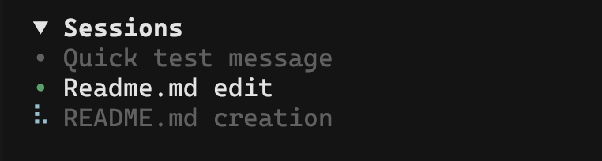

[English](./README.md) | 简体中文

# opencode-sessions-sidebar



OpenCode TUI 插件，在侧边栏显示当前项目的活跃会话列表。

需要 **OpenCode 2.x**（v2 插件 API）。OpenCode 1.x 用户请继续使用 `0.1.x`。

## 功能特性

- **会话列表**：显示当前项目最近更新的最多 10 个会话（可配置）
- **点击切换**：点击列表中的任意会话即可立即跳转
- **当前会话标记**：活跃会话以 `•` 圆点标识，使用主题 success 色（与 MCP 已连接状态一致）
- **运行中指示器**：正在生成的会话显示盲文旋转动画
- **目录作用域**：仅显示属于当前会话所在目录的会话
- **仅根会话**：不显示 subagent（子）会话，与内置会话列表一致
- **实时列表**：从服务端拉取，并在 `session.created` / `session.renamed` / `session.deleted` 时重载
- **可折叠面板**：点击标题栏可折叠/展开；标题栏显示会话数量；状态在重启后保持
- **斜杠命令**：`/sessions-count` 设置显示的最大会话数量
- **原生外观**：无框线面板，样式与内置 MCP 侧栏块一致，直接使用主题颜色；会话标题占一行、超出截断

## 安装

```bash
opencode plugin add opencode-sessions-sidebar
```

该命令会安装插件并把注册项写进 `~/.config/opencode/opencode.json`。

手动方式——自己往 `plugins` 数组里加：

```jsonc
{
  "$schema": "https://opencode.ai/config.json",
  "plugins": ["opencode-sessions-sidebar"]
}
```

重启 OpenCode，进入任意会话，侧边栏即会出现 Sessions 面板。

## 斜杠命令

| 命令 | 说明 |
|---------|-------------|
| `/sessions-count` | 设置显示的最大会话数量（1-100） |

同一功能也可从命令面板（`Ctrl + P`）的 `Sessions: Set Max Count` 调用。

## 开发

```bash
npm install
npm run build      # tsc + esbuild 把 src/index.tsx 打成 dist/tui.js
npm run typecheck
```

本地源码目录可以不发布直接加载。TUI 会在插件目录下找 `tui`，所以把产物放到 `<目录>/tui.js`：

```bash
npm run build
mkdir -p local && cp dist/tui.js local/tui.js
```

```jsonc
{
  "plugins": ["/绝对路径/local"]
}
```

## 许可证

MIT
